<a href="https://jeremygracey.ai">
  <picture>
    <source media="(max-width: 700px)" srcset="assets/hero-mobile.svg">
    
  </picture>
</a>

  <a href="https://jeremygracey.ai">jeremygracey.ai</a> ·
  <a href="https://www.linkedin.com/in/jeremygracey-ai/">LinkedIn</a> ·
  <a href="https://huggingface.co/jeremygracey-ai">Hugging Face</a> ·
  <a href="mailto:jeremy.a.gracey@gmail.com">jeremy.a.gracey@gmail.com</a> ·
  <a href="mailto:gracey.ai@outlook.com">gracey.ai@outlook.com</a>

AI/ML engineer and technical founder in Seattle. I build agent systems that hold up under audit: pipelines that log their decisions, memory with governance and replay, RAG that cites the exact page behind every claim.

Before software I worked emergency medicine, acute psychiatric care, and special education. Nobody in those rooms accepts "trust me" as an answer, and I never learned to accept it from software either. Everything below is built to that standard.

<h3>
  <picture>
    <source media="(max-width: 700px)" srcset="assets/section-opus-one-mobile.svg">
    
  </picture>
</h3>

**[Prime Radiant](https://github.com/JeremyGracey-AI/prime-radiant)** is my best work to date: a CDC FluSight forecaster that predicts weekly flu hospital admissions for all 53 FluSight locations, 23 quantiles at a time. It is [registered with the CDC FluSight hub](https://github.com/cdcepi/FluSight-forecast-hub/pull/3696) as `JGracey-prime_radiant`.

It is built vintage-honest. The model never sees data dated after the forecast moment: training data is checked out of the hub's git history as it existed on that date. The backtest replays the same pipeline the weekly job runs, over 85 weekly origins across three seasons.

In the 2025-26 backtest its LightGBM model edges UMass-flusion, the top-ranked model in FluSight 2023-24, on natural-scale relative WIS (0.609 vs 0.625) and trails it by 0.002 on the log scale. UMass-flusion beats it in 2023-24 and 2024-25. The registered entry is the ensemble of that model and a CDC-baseline replica, and it scores 0.764 in 2025-26. The Prime Radiant README prints every table just as plainly.

The offline test suite sits at 100% coverage with the CI gate set there. The workflow gates are pinned by tests checked against hand-run mutants. A weekly scheduled dry run keeps the pipeline exercised.

[The codebase, drawn](https://jeremygracey.ai/prime-radiant) · [dashboard](https://huggingface.co/spaces/jeremygracey-ai/prime-radiant) · [PyPI](https://pypi.org/project/prime-radiant/)

<h3>
  <picture>
    <source media="(max-width: 700px)" srcset="assets/section-built-with-roboflow-mobile.svg">
    
  </picture>
</h3>

**[prevera-guardian-lidar](https://github.com/JeremyGracey-AI/prevera-guardian-lidar)** is a fall-detection research prototype on a Jetson Orin Nano: a floor-level 2D LIDAR that finds a person lying down from geometry alone, plus RF-DETR served on the device by Roboflow Inference for the poses the LIDAR misses.

- **The blind spot.** Lying end-on with feet toward the sensor, a person is two 0.3 m clusters to the LIDAR, and the detector raised 0 events in 33 seconds. Stock RF-DETR found the person in 33 of 33 frames on each camera. That ran on recorded frames; it is not in the live loop yet.
- **The fine-tune.** I fine-tuned RF-DETR on Roboflow to predict pose as a class, on public fall data, under a plan committed before training started. The model the plan picked passed its bars on the public test split. The device-sized model passed its bars on room frames from the counter camera; from the floor camera it read a head-first lie-down as standing in 30 of 30 frames. Both results are in the repo.
- **Upstream.** The JetPack 6.2.0 Inference image returned HTTP 500 for every RF-DETR request under the documented `--read-only` container command. I sent the one-line fix and a unit test as [roboflow/inference#3072](https://github.com/roboflow/inference/pull/3072).

Every evaluation is declared before it runs and the failures are published beside the passes. One subject, one room; not a medical device; patent pending.

<h3>
  <picture>
    <source media="(max-width: 700px)" srcset="assets/section-what-i-build-mobile.svg">
    
  </picture>
</h3>

Five more threads, each with public code behind it.

**Agent infrastructure.** The plumbing that makes autonomous agents accountable. [Compass BlackBox IQ](https://github.com/JeremyGracey-AI/Agents-League-Hackathon-Compass-BlackBox-IQ) is a flight recorder for agents: git-backed memory, decision records, and a skill forge, exposed over MCP. [llm-council-mcp](https://github.com/JeremyGracey-AI/llm-council-mcp) runs multi-model deliberation as an MCP server for Claude Code and ships on PyPI as `mcp-llm-council`.

**Agent governance.** [governance-drift-researcher](https://github.com/JeremyGracey-AI/governance-drift-researcher) detects drift in an AI-agent estate: every finding carries verifiable evidence, findings that can't be re-verified are dropped, and nothing publishes without human sign-off. [Run it live on WeaveMind Cloud](https://app.weavemind.ai/app#/p/gracey_dev/governance-drift-researcher-v2) for about $0.03, or `pip install governance-drift`. [guss](https://github.com/JeremyGracey-AI/guss) is the same philosophy on 7 watts: a Jetson-hosted agent that monitors itself, heals itself, paper-trades against a benchmark, and publishes its own dashboard.

**Compilers and GPU performance.** [triton-kernel-lab](https://github.com/JeremyGracey-AI/triton-kernel-lab) is hand-written Triton kernels with honest benchmarks on a Jetson Orin Nano, plus a working study of LLVM, MLIR, and TorchDynamo/Inductor.

**Neurotech and edge hardware.** [nexus-neuromirror](https://github.com/JeremyGracey-AI/nexus-neuromirror) is offline-first EEG neurofeedback for the Mind Media NeXus-10, from EDF verification to a live dashboard. `pip install nexus-neuromirror`.

**Clinical AI on open standards.** [clinical-ai-agent](https://github.com/JeremyGracey-AI/clinical-ai-agent) is citation-traceable decision support on SMART on FHIR: a five-agent pipeline with dual citations back to patient data and clinical sources. [Hospital-Readmission-Prediction-Model](https://github.com/JeremyGracey-AI/Hospital-Readmission-Prediction-Model) covers the classical ML side, synthetic EHR data through SHAP-based clinical interpretation.

Off GitHub: customer-facing agents for real businesses, handling booking, triage, and operations. Deployed and in use.

<h3>
  <picture>
    <source media="(max-width: 700px)" srcset="assets/section-beyond-the-pins-mobile.svg">
    
  </picture>
</h3>

The pins are the front door. These hold up past the first click too.

<b>Six more repositories</b>

 

- [provenance](https://github.com/JeremyGracey-AI/provenance): RAG over textbook page images that verifies every claim against the exact page that proves it. Cohere Embed v4 retrieval, Claude vision answers.
- [calibrated-readiness](https://github.com/JeremyGracey-AI/calibrated-readiness): multi-agent exam-readiness scoring with a 60-second reliability-diagram check. Microsoft Foundry Agent Framework + Foundry IQ.
- [rag-healthcare-ai](https://github.com/JeremyGracey-AI/rag-healthcare-ai): fully local medical Q&A over the Merck Manual. Mistral-7B on llama.cpp, ChromaDB, no API in the loop.
- [healthcare-vjepa2-agent](https://github.com/JeremyGracey-AI/healthcare-vjepa2-agent): V-JEPA 2 and Claude read medical procedure videos and generate teaching material (step breakdowns, narration, quizzes, safety notes).

Classical ML lives in [helmnet](https://github.com/JeremyGracey-AI/helmnet), VGG-16 transfer learning with thresholds tuned for zero-harm deployment, and [renewind-predictive-maintenance](https://github.com/JeremyGracey-AI/renewind-predictive-maintenance), seven Keras architectures against imbalanced turbine sensor data.

<h3>
  <picture>
    <source media="(max-width: 700px)" srcset="assets/section-now-mobile.svg">
    
  </picture>
</h3>

Consulting through the Claude Partner Network. Digging into what neuropsychology's models of memory can teach agent memory design. Open to applied-AI and systems roles in Seattle or SF.

<a href="https://jeremygracey.ai">
  <picture>
    <source media="(max-width: 700px)" srcset="assets/footer-mobile.svg">
    
  </picture>
</a>
